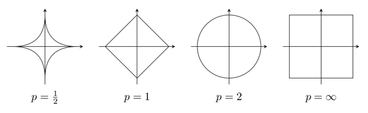

# Chapter 2 Norms

### 1. Vector norms

A vector norm on $\mathbb C^n$ is a map $\|\cdot\|: \mathbb C^n \rightarrow \mathbb R^+$ satisfying

(1) $\|x\| \ge 0$ and $\|x\| = 0$ iff $x=0$

(2) $\|x+y\|\le \|x\| + \|y\|$, $\forall x, y\in \mathbb C^n$

(3) $\|\alpha x\| = |\alpha|\|x\|$,  $\forall x\in \mathbb C^n$, $\forall \alpha\in \mathbb C$

For example:

- **p-norm**: for $p\in[1, \infty)$, $\|x\|_p = \left[\sum_{i=1}^n|x_i|^p\right]^{1/p}$.

- **Euclidean norm**: $p=2$, $\|x\|_2 = \sqrt{<x, x>}$
- **Infinity norm**: $\|x\|_\infty = \max_{i=1, ...n}|x_i|$

#### Unit ball in $\mathbb R^2$

The set of points $S=\{x\in\mathbb R^2: \|x\|\le 1\}$.

#### Weighted norm

If $W$ is **nonsingular** matrix ($\Leftrightarrow$ invertible $\Leftrightarrow \det W=0$), $\|x\|_W = \|Wx\|$ is a matrix norm.

**Theorem 1**: all norms on $\mathbb C^n$ are equivalent.

> If $\|\cdot\|$, $\|\cdot\|^2$, $\exists c, C>0$ s.t. $\forall x\in\mathbb C^n$, $c\|x\|^2 \le \|x\| \le C\|x\|^2$.

Proof: Consider two norms $\|\cdot\|$, $\|\cdot\|^2$, using property (3) it suffices to consider vectors $x\in \mathbb C^n$: $\|x\|_2=1$. This could represent all nonzero vectors, since $\|x\|=0$ is trivial.

Let $S:= \{x\in\mathbb C^n: \|x\|_2=1\}$. *This is the unit ball, and it is compact only in finite dimensions*. By property (1) (nonzero), define
$$
f:S\rightarrow R, \quad f(x):=\frac{\|x\|^2}{\|x\|}
$$
We can observe that $f$ is a continuous function. Since $f$ is continuous and $S$ is compact (closed and bounded in finite space), $f$ attains its min and max on $S$. Thus $\exists x_m, x_M\in S$, $f(x_m)\le f(x)\le f(x_M)$ for $\forall x\in S$.

### 2. Dual space

Given a norm $\|\cdot\|$ on $\mathbb C^n$, the pair $(\mathbb C^n, \|\cdot\|)$ is **Banach space** $B$.

The **dual** of $(\mathbb C^n, \|\cdot\|)$ is the Banach space $B'$, the pair $(\mathbb C^n, \|\cdot\|_{B'})$ where $\|x\|_{B'}:=\max_{\|y\|=1}|\left<x, y\right>$.

#### Hölder's inequality

$$
|\left<x, y\right>| \le \|x\|_p\|y\|_q, \qquad \frac{1}{p} + \frac{1}{q} = 1
$$

**Theorem 2**: if $p, q\in[1, \infty]$ and $1/p+1/q = 1$, the Banach space $(\mathbb C^n, \|\cdot\|_p)$, $(\mathbb C^n, \|\cdot\|_q)$ are dual to each other.

### 3. Matrix norm

A matrix norm is a map $\|\cdot\|:\mathbb C^{m\times n}\rightarrow \mathbb R^+$ s.t.

(1) $\|A\|\ge 0$ and $\|A\| = 0$ iff $A=0$

(2) $\|A+B\| \le \|A\| + \|B\|$ for $\forall A, B\in \mathbb C^{m\times n}$

(3) $\|\alpha A\| = \alpha\|A\|$ for $\forall \alpha\in\mathbb C$

#### Matrix norm induced by vector norms

$$
\|A\|_{(m, n)} = \sup_{x\neq 0} \frac{\|Ax\|_{\dim m}}{\|x\|_{\dim n}}
$$

where $\|\cdot\|_{\dim m}$ is a vector norm in $\mathbb C^m$ and $\|\cdot\|_{\dim n}$ is a vector norm in $\mathbb C^n$.

This is the usual definition of linear operator nrom.

**Example**: the $\|\cdot\|_{(1,1)}$ norm
$$
\frac{\|Ax\|_1}{\|x\|_1} = \frac{\sum_{j=1}^n|x_j|\|a_j\|_1}{\sum_{j=1}^n|x_j|}\le \max_j \|a_j\|_1
$$
This shows $\|A\|_{(1,1)}\le\max_j\|a_j\|_1$. Let the index of this maximum $j_M$ and define $x=e_{j_M}$.
$$
\|A\|_{(1,1)}\ge \frac{\|Ae_{j_M}\|_1}{\|e_{j_M}\|_1} = \|a_{j_M}\|_1 = \max_j\|a_j\|_1
$$
Thus $\|A\|_{(1,1)} = \max_{j=1,...n}\|a_j\|_1$.

**Example**: the $\|\cdot\|_{(\infty,\infty)}$ norm
$$
\frac{\|Ax\|_\infty}{\|x\|_\infty} = \frac{\max_{i=1,...n}|\sum_{j=1}^nx_ja_{ij}|}{\max_{j=1,...n}|x_j|}\le \frac{\max_j |x_j|\max_{i=1,...n}\sum_{j=1}^n|a_{ij}|}{\max_j|x_j|}
$$
$\|A\|_{(\infty,\infty)} \le \max_{i=1,...n}\sum_{j=1}^n|a_{ij}|$.

And $\|A\|_{(\infty,\infty)} \ge \max_{i=1,...n}\sum_{j=1}^n|a_{ij}|$.

Thus $\|A\|_{(\infty,\infty)} = \max_{i=1,...n}\sum_{j=1}^n|a_{ij}|$.

#### Frobenius norm  is not vector induced

$$
\|A\|_F := \sqrt{\left<A, A\right>_F} = \left[\sum_{i=1}^m\sum_{j=1}^n|a_{ij}|^2\right]^{1/2} = \sqrt{\operatorname{tr}A^*A}, \qquad A\in \mathbb C^n
$$

### 4. Invariance under unitary transformation

If $Q\in \mathbb C^{m\times m}$ is unitary and $A\in \mathbb C^{m\times n}$:
$$
\|Qy\|_2 = [\left<Qy,Qy \right>]^{1/2} = [y^*Q^*Qy]^{1/2} = \|y\|_2,\qquad\forall y\in \mathbb C^m.
$$
Thus, 
$$
\|QA\|_2 = \sup_{x\neq 0}\frac{\|QAx\|_2}{\|x\|_2} = \sup\frac{\|Ax\|_2}{\|x\|_2} = \|A\|_2
$$
Moreover, 
$$
\|QA\|_F = \left[\operatorname{tr}(A^*Q^*QA)\right]^{1/2} = \|A\|_F
$$

